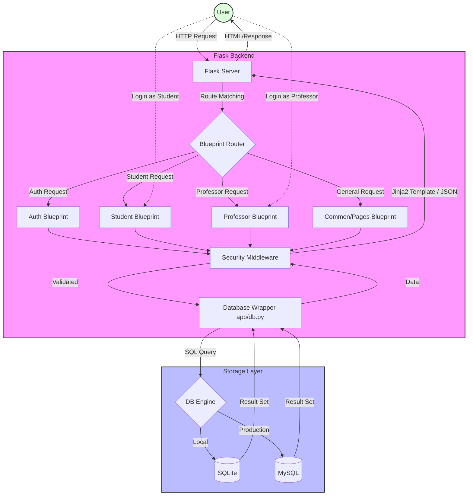

# Project Architecture Flowchart (Mermaid)

```mermaid
graph TD
    %% User Layer
    User((User)) -->|HTTP Request| Server[Flask Server]

    %% Backend Layer
    subgraph Backend [Flask Backend]
        Server -->|Route Matching| Router{Blueprint Router}
        Router -->|Auth Request| AuthBP[Auth Blueprint]
        Router -->|Student Request| StudentBP[Student Blueprint]
        Router -->|Professor Request| ProfBP[Professor Blueprint]
        Router -->|General Request| CommonBP[Common/Pages Blueprint]
        
        AuthBP --> Security[Security Middleware]
        StudentBP --> Security
        ProfBP --> Security
        CommonBP --> Security
        
        Security -->|Validated| DBWrapper[Database Wrapper app/db.py]
    end

    %% Data Layer
    subgraph Data [Storage Layer]
        DBWrapper -->|SQL Query| Engine{DB Engine}
        Engine -->|Local| SQLite[(SQLite)]
        Engine -->|Production| MySQL[(MySQL)]
    end

    %% Response Cycle
    SQLite -->|Result Set| DBWrapper
    MySQL -->|Result Set| DBWrapper
    DBWrapper -->|Data| Security
    Security -->|Jinja2 Template / JSON| Server
    Server -->|HTML/Response| User

    %% Role Interactions
    User -.->|Login as Student| StudentBP
    User -.->|Login as Professor| ProfBP
    
    style Backend fill:#f9f,stroke:#333,stroke-width:2px
    style Data fill:#bbf,stroke:#333,stroke-width:2px
    style User fill:#dfd,stroke:#333,stroke-width:2px
```
