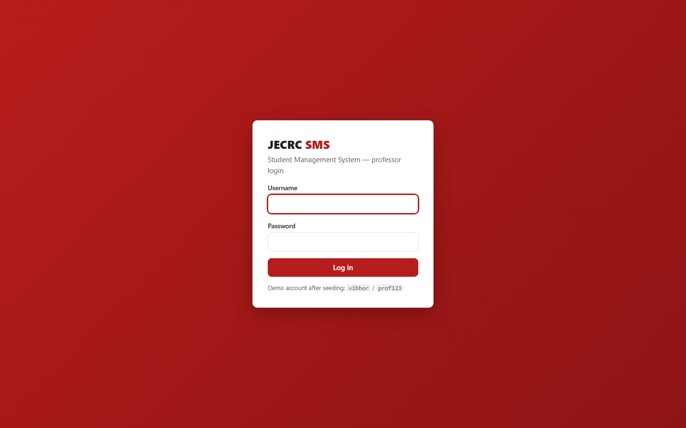
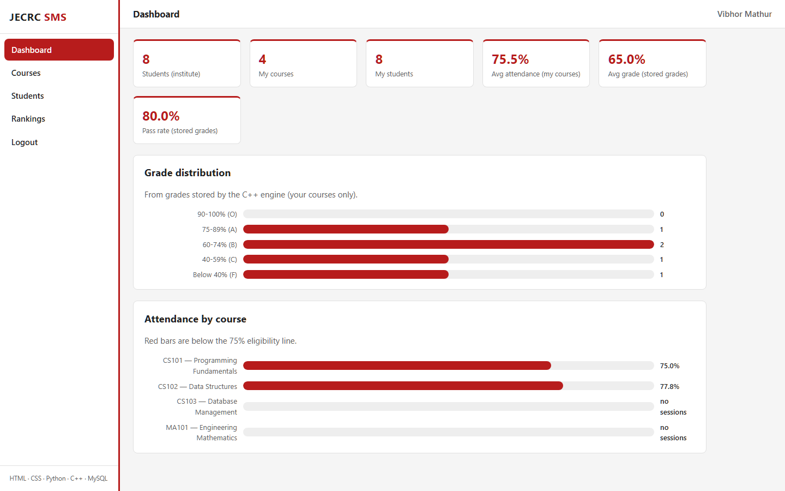
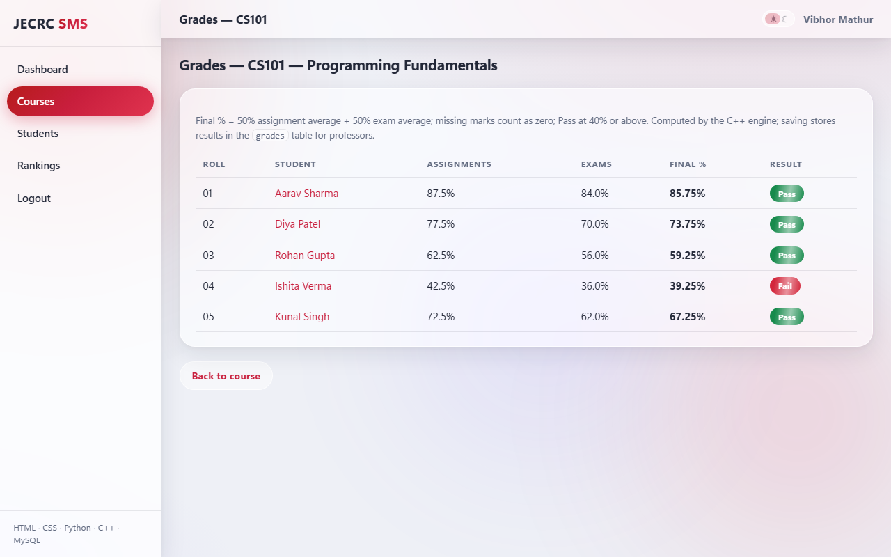
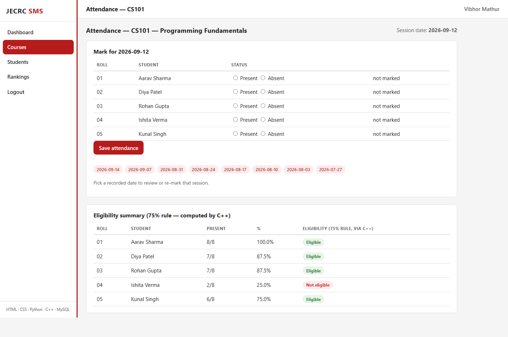
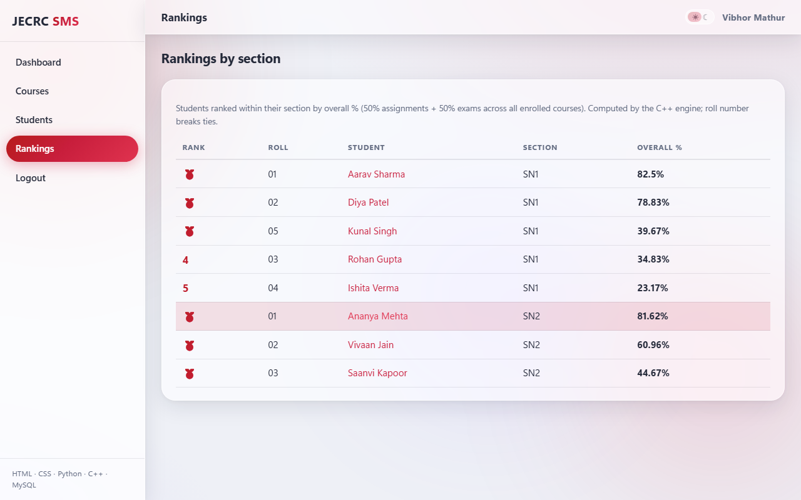
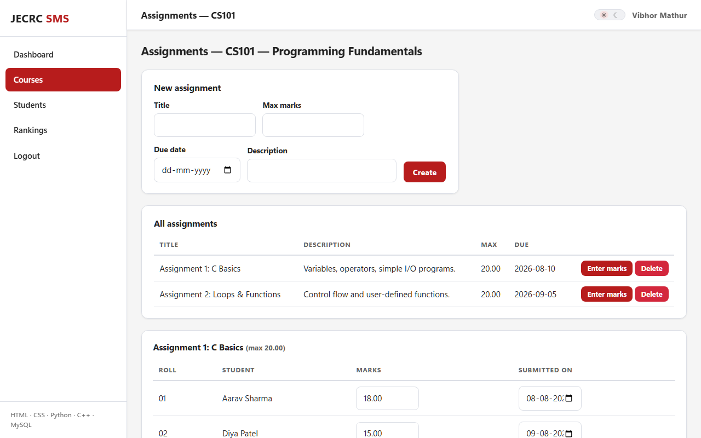

# Student Management System (SMS)

A Student Management System for professors: courses, enrollments, students, assignments, exams, marks, grades, attendance, and rankings — built end-to-end on a deliberately framework-free stack: **HTML/CSS frontend + plain-Python backend (`http.server`) + C++ compute engine (subprocess) + MySQL**. No JavaScript, no frameworks, no templating libraries — every layer is hand-written and explainable.

> Full documentation lives in [`docs/`](docs/): the project [overview](docs/OVERVIEW.md) (purpose, architecture, key decisions, known limitations), MySQL setup, UI guide, and a guided [code tour](docs/CODE_TOUR.md).

## Why this project

Most first-semester projects hide behind a framework. This one doesn't: routing, form parsing, sessions, password hashing, HTML templating, and even the dashboard charts are written from scratch — so every line can be explained in a viva or interview. The C++ module is scoped to exactly three computations (grades, attendance eligibility, ranking) so there's a crisp answer to *"why C++ here?"*.

## Tech Stack

| Layer | Technology | Role |
|---|---|---|
| Frontend | HTML, CSS | 15 semantic templates, one stylesheet, CSS-only charts, zero JS |
| Backend | Python (stdlib `http.server`) | Regex routing, form parsing, PBKDF2 auth, sessions, validation |
| Compute | C++ (`sms_engine`) | Grade %, attendance eligibility, section ranking — via subprocess |
| Data | SQL on MySQL 8 | 12 tables, 3NF, parameterized queries via PyMySQL |

## Features

- Professor login/logout — PBKDF2-salted passwords, in-memory sessions, HttpOnly cookies
- Per-professor scoping — every professor sees all students, but only **course owners** can modify; enforced server-side (403), not just hidden in the UI
- Student CRUD with search/filters (name, roll, course, section) and per-section roll-number uniqueness
- Courses tied to one professor + one section + one weekly slot, with **schedule-clash detection** so parallel sections (SN1/SN2) can run labs simultaneously
- Assignments & exams with per-student marks-entry grids (marks validated against max)
- **Grades via C++**: final % = 50% assignments + 50% exams (only *conducted* assessments count), Pass ≥ 40%
- **Attendance via C++**: per-course %, hard 75% eligibility cutoff, marked per session date
- **Rankings via C++**: students ranked within their section by overall %, roll number as tie-break, shared ranks for ties
- Dashboard with summary cards and **pure CSS bar charts** (grade distribution, attendance by course)

## Architecture

```
┌─────────────────────────┐
│  Presentation (browser) │  HTML + CSS rendered server-side as strings — no JS
└───────────┬─────────────┘
            │ HTTP
┌───────────▼─────────────┐
│  Application (Python)   │  http.server → regex router → route handlers
│                         │  ├─ validation ──► 400/403/404 error pages
│                         │  ├─ models/ ──► PyMySQL (parameterized SQL)
│                         │  └─ auth ──► PBKDF2 + in-memory sessions
└───────────┬─────────────┘
            │ subprocess (TSV over stdin/stdout)
┌───────────▼─────────────┐      ┌──────────────────────┐
│  C++ sms_engine         │      │  Data (MySQL 8)      │
│  grades|attendance|rank │      │  12 tables, 3NF      │
└─────────────────────────┘      └──────────────────────┘
```

**C++ integration:** Python queries MySQL, feeds the compiled binary TSV on stdin, parses its stdout back. `sms_engine` runs in three modes (`grades`, `attendance`, `rank`) — see `cpp_module/README.md` for the exact wire format.

## Project Structure

```
├── backend/
│   ├── server.py            # stdlib HTTP server entrypoint
│   ├── auth.py              # PBKDF2 hashing + session store
│   ├── cpp_engine.py        # subprocess bridge to sms_engine
│   ├── config.py            # local credentials (git-ignored; see config.example.py)
│   ├── db/                  # schema.sql + seed.sql (source of truth)
│   ├── models/              # data-access layer, one module per domain
│   └── routes/              # route handlers + tiny template engine + validation
├── cpp_module/
│   ├── src/sms_engine.cpp   # one binary, three modes
│   ├── tests/               # stdin fixtures with hand-computed expected outputs
│   └── build/               # compiled binary (git-ignored)
├── frontend/
│   ├── templates/           # 16 HTML templates ({{placeholder}} substitution)
│   └── static/css/          # the one stylesheet
├── scripts/                 # setup_db.py, build_cpp.py
└── docs/                    # OVERVIEW + code tour, MySQL setup, UI guide
```

## Setup & Run

Prerequisites: Python 3.10+, a C++ compiler (`g++`), and MySQL 8 — see [`docs/MYSQL_SETUP.md`](docs/MYSQL_SETUP.md) for the full install walkthrough.

```bash
pip install -r requirements.txt      # PyMySQL + cryptography
python scripts/build_cpp.py          # compile the C++ engine
python scripts/setup_db.py           # create DB + app user + schema + demo data
python backend/server.py             # http://127.0.0.1:8000
```

Demo logins (from seed data): `vibhor / prof123` (owns 4 courses) and `sharma / prof123` (owns 1 — good for showing per-professor scoping).

> `backend/config.py` holds local DB credentials and is git-ignored; copy `backend/config.example.py` and fill in your values if setting up manually.

## Screenshots

| | |
|---|---|
| **Login** | **Dashboard (CSS-only charts)** |
|  |  |
| **Grades — computed by the C++ engine** | **Attendance & 75% eligibility (C++)** |
|  |  |
| **Section rankings (C++)** | **Marks entry grid** |
|  |  |

## What I built & learned

- Wrote an HTTP server and router from stdlib primitives — status codes, headers, cookies, and redirects stopped being magic.
- Learned why parameterized SQL matters by doing it everywhere, including a least-privilege DB user instead of running the app as root.
- Designed a schema to 3NF with real constraints (per-section roll uniqueness, professor double-booking checks, cascade deletes) and an ERD-level understanding of why.
- Defined a clean Python↔C++ boundary with a text protocol, and a class of bugs it avoids (DB types like MySQL `TIME` arrive as `timedelta` in Python — formatting stays app-side).
- Hit and fixed real correctness issues: unheld exams unfairly counted as zeros, permission edge cases for freshly created records — the difference between "works on my data" and "works".

## Future Work

- Deploy beyond localhost (config is already environment-driven)
- CSV/PDF report export, DB-backed sessions, automated test suite, CI — deliberate non-goals for v1 (see docs/OVERVIEW.md)

---

**Author:** Vibhor Mathur — B.Tech CSE (AI DevOps & Cloud Automation), first semester · License: [MIT](LICENSE)
