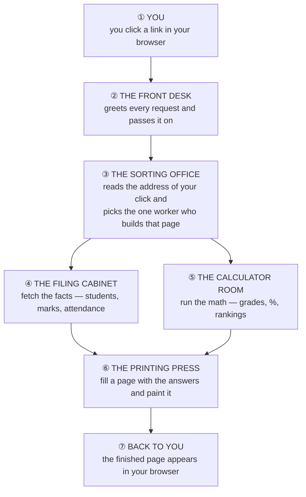
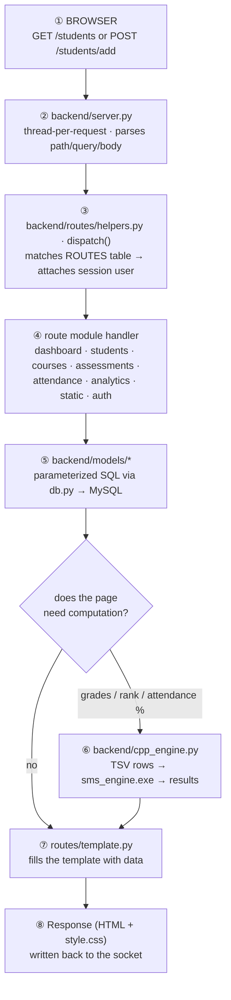
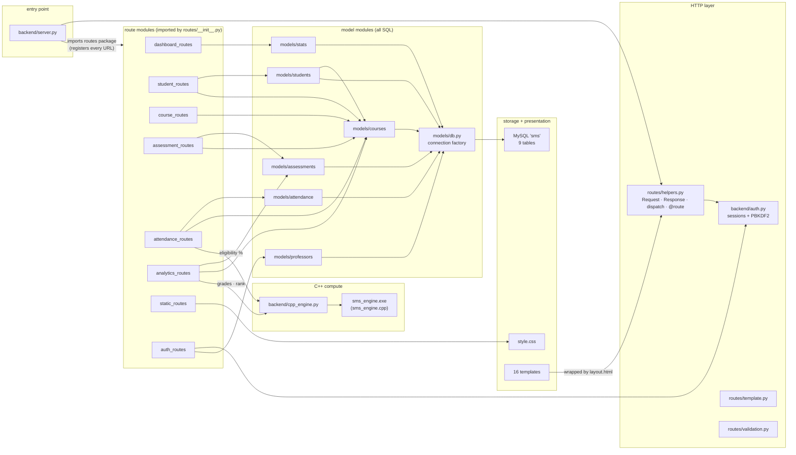

# Flowchart — how everything connects

This page explains the whole project **without assuming you know
programming**. Start with §1 — it is the same story as the picture
([`flow-diagram.png`](flow-diagram.png), editable source
[`flow-diagram.svg`](flow-diagram.svg)). §2 maps the nicknames to the real
files, and §3 is the full technical wiring for when you're ready to read code.

---

## 1. The story (no programming knowledge needed)

When you click **any** button in this app, the same seven-step story plays out
in a fraction of a second:

| Step | What happens | Who does it |
|---|---|---|
| ① You | You open the app and click a link or button. Any modern browser works — nothing to install on your machine. | — |
| ② The front desk | Greets every request that arrives and hands it to the right helper. If you're not logged in yet, it sends you to the login page first. | `backend/server.py` |
| ③ The sorting office | Reads the *address* of your click (the part after `/` in the URL) and picks the one worker who builds that kind of page. There are 8 workers: dashboard, students, courses, marks, attendance, rankings, login, and style files. | `backend/routes/helpers.py` |
| ④ The filing cabinet | Every fact the app knows lives here in labeled drawers: students, courses, who teaches what, who studies what, marks, attendance, grades. The workers only *ask* for facts — they never rummage themselves. | MySQL database, via `backend/models/` |
| ⑤ The calculator room | Some pages need math, not just facts: final grades (50% coursework + 50% exams), attendance % (eligible at 75%), class rankings. A separate mini-program written in C++ does this — marks go in, answers come out. | `cpp_module/sms_engine`, fed by `backend/cpp_engine.py` |
| ⑥ The printing press | Fills a blank page with the answers, then paints it in the app's red-and-white style. | `frontend/templates/` + `frontend/static/css/style.css` |
| ⑦ Back to you | The finished page appears in your browser. Every click runs this same loop again. | — |

**One-time setup (before first use):** `python scripts/setup_db.py` builds and
fills the filing cabinet; `python scripts/build_cpp.py` builds the calculator.
Both are already done on this machine.

---

## 2. The cast — nickname → real file

| Nickname | Real file(s) | Its one job |
|---|---|---|
| Front desk | `backend/server.py` | Listens for visitors, one thread per request |
| Sorting office | `backend/routes/helpers.py` | Matches the URL to the right worker, attaches your login |
| The 8 workers | `backend/routes/*_routes.py` | Each builds one kind of page |
| Filing cabinet drawers | the 9 tables in `backend/db/schema.sql` | professors, sections, students, courses, enrollments, assessments, marks, grades, attendance |
| Cabinet clerks | `backend/models/*.py` | The only code allowed to fetch/store facts |
| Calculator | `cpp_module/src/sms_engine.cpp` | Grades, attendance %, rankings — pure math, no storage |
| Calculator operator | `backend/cpp_engine.py` | Hands data to the calculator, collects answers |
| Printing press | `backend/routes/template.py` + `frontend/templates/` | Fills page layouts with data |
| The paint | `frontend/static/css/style.css` | The red-and-white look |
| Setup tools | `scripts/setup_db.py`, `scripts/build_cpp.py` | Build the cabinet; build the calculator |

**The 9 drawers explained:** a *professor* logs in and teaches *courses*; each
course belongs to a *section* (a class group like SN1) full of *students*;
*enrollments* record who studies what; *assessments* are the homework and
exams; *marks* are the scores earned; the calculator turns marks into *grades*;
*attendance* remembers who was present.

---

## 3. The technical view (for when you're ready to read code)

### 3a. The life of one request

**Error mapping (in `dispatch()`, one place):** `ValueError → 400`,
`PermissionError → 403`, `NotFound → 404`, anything else → logged + friendly 500.

### 3b. Which file imports what

### Connection rules (what makes the graph this shape)

1. **`server.py` touches nothing below the HTTP layer.** It imports
   `backend.routes` (which registers all URLs via the `@route` decorator) and
   calls `dispatch()`. It never sees MySQL or templates.
2. **Routes never write SQL.** Every route module talks only to
   `backend/models/*` — a query change can't break a URL and vice versa.
3. **Only `models/db.py` knows the connection parameters** (via
   `backend/config.py`). No other module opens a database connection.
4. **Only two workers know the calculator exists:** `attendance_routes`
   (eligibility %) and `analytics_routes` (grades + rankings). `cpp_engine.py`
   hides the details: tab-separated text in, results out, 30-second timeout,
   a friendly error if the calculator was never built.
5. **Ownership checks live in the models, not the UI.** `courses.get_owned()`
   raises `PermissionError` (→ 403), so scoping can't be bypassed by
   hand-crafting URLs.
6. **Setup scripts sit outside the request loop:** `scripts/setup_db.py`
   creates the database + least-privilege `sms_app` user and applies
   `schema.sql` → `seed.sql`; `scripts/build_cpp.py` compiles the engine.

### 3c. One feature end-to-end: "view final grades"

1. `analytics_routes.gradebook(request)` — route matches `/courses/<id>/grades`
2. `courses.get_owned(course_id, request.user)` — raises `PermissionError`
   unless you teach this course (403)
3. `assessments.for_course(...)` — pulls assessments + marks from MySQL
4. `cpp_engine.run("grades", rows)` — TSV in → `sms_engine.exe` → per-student
   `final % = 50% assignments + 50% exams`, Pass/Fail at ≥ 40%
5. `template.render("grades.html", ...)` — table + summary chips
6. `server.py` writes the HTML; browser pulls `style.css`

Attendance is the same shape with `attendance.py` + mode `attendance`
(eligible at ≥ 75%), rankings with mode `rank`.
