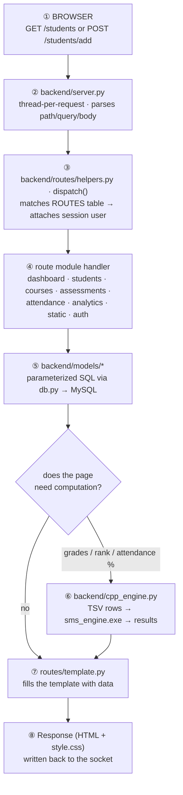
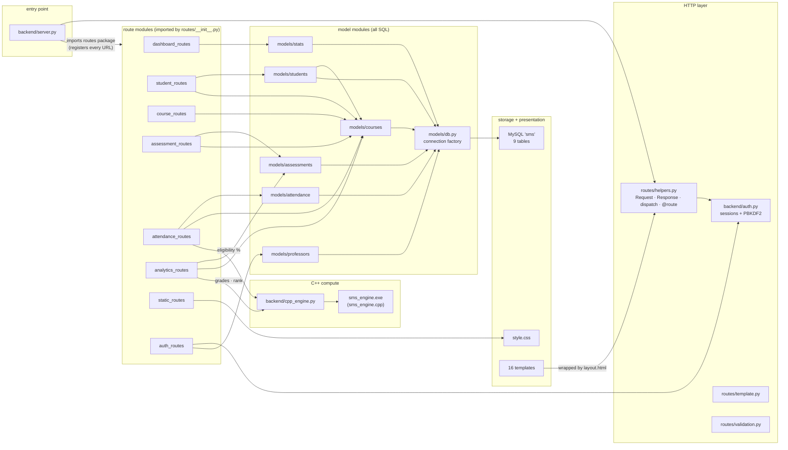

# Flowchart — how everything connects

Two ways to read this project: **what a request's life looks like** (§1) and
**which file is wired to which** (§2). The rendered diagram lives in
[`flow-diagram.png`](flow-diagram.png) (editable source: [`flow-diagram.svg`](flow-diagram.svg),
generated from the Mermaid blocks in this file).

---

## 1. The life of one request (the 8-step loop)

Every page load follows the same loop — the only difference between
"Dashboard" and "Enter marks" is which handler runs at step ③.

| Step | File(s) | What happens |
|---|---|---|
| ① | the browser | Click a link / submit a form → HTTP request to `127.0.0.1:8000` |
| ② | `backend/server.py` | `ThreadingHTTPServer` accepts; `_build_request()` parses path, query, form body, cookies into a `Request` |
| ③ | `backend/routes/helpers.py` | `dispatch(request)` scans the `ROUTES` table (regex patterns) and calls the matching handler with `request.user` attached |
| ④ | `backend/routes/*_routes.py` | The handler validates input (`validation.py`), checks ownership, and asks the models for data |
| ⑤ | `backend/models/*.py` | Every query in the app lives here — parameterized, one fresh connection per call (`db.py`), commits on writes |
| ⑥ | `backend/cpp_engine.py` → `cpp_module/build/sms_engine.exe` | Only for computation: grades (50/50 pass ≥ 40), attendance % (eligible ≥ 75), section ranking |
| ⑦ | `backend/routes/template.py` | Renders the page's template inside `layout.html` with the model data |
| ⑧ | `backend/server.py` | The `Response` (status, headers, HTML) goes back to the socket; the browser loads `style.css` from `static_routes.py` |

**Error mapping (in `dispatch()`, one place):** `ValueError → 400`,
`PermissionError → 403`, `NotFound → 404`, anything else → logged + friendly 500.

---

## 2. The file-connection map

Which file imports what — the actual wiring of the codebase.

### Connection rules (what makes the graph this shape)

1. **`server.py` touches nothing below the HTTP layer.** It imports `backend.routes`
   (which registers all URLs via the `@route` decorator) and calls `dispatch()`.
   It never sees MySQL or templates.
2. **Routes never write SQL.** Every route module talks only to
   `backend/models/*` — so a query change can't break a URL and vice versa.
3. **Only `models/db.py` knows the connection parameters** (via `backend/config.py`,
   the file you edit after installing MySQL). No other module opens a socket.
4. **Only two route modules know the C++ engine exists:** `attendance_routes`
   (eligibility %) and `analytics_routes` (grades + rankings). `cpp_engine.py`
   hides the subprocess: TSV on stdin, results on stdout, 30-second timeout,
   `EngineError` → friendly page if the binary was never built.
5. **Ownership checks live in the models, not the UI.** `courses.get_owned()`
   raises `PermissionError` (→ 403), so scoping can't be bypassed by hand-crafting URLs.
6. **Setup scripts sit outside the request loop:** `scripts/setup_db.py` creates the
   database + least-privilege `sms_app` user and applies `schema.sql` → `seed.sql`;
   `scripts/build_cpp.py` compiles the engine. Both are run-once tools.

---

## 3. One feature end-to-end: "view final grades"

The fastest way to see the whole graph move at once:

1. `analytics_routes.gradebook(request)` — route matches `/courses/<id>/grades`
2. `courses.get_owned(course_id, request.user)` — raises `PermissionError` unless you teach it (403)
3. `assessments.for_course(...)` — pulls assessments + marks from MySQL (`models/assessments.py`)
4. `cpp_engine.run("grades", rows)` — TSV in → `sms_engine.exe` → per-student
   `final % = 50% assignments + 50% exams`, Pass/Fail at ≥ 40%
5. `template.render("grades.html", ...)` — table + summary chips
6. `server.py` writes the HTML; browser pulls `style.css`

Attendance is the same shape with `attendance.py` + mode `attendance`
(eligible at ≥ 75%), rankings with mode `rank`.
